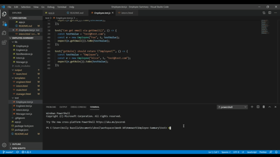

# Employee-Summary

This application is a team summary generator. Using a CLI, the user can input their teams information and it will create a readable profile page with key information about each team member. 

## How to use

This application uses a Command-line Interface, or CLI. The user will run it by typing "node app.js" in the terminal of the app.js file. The user will then be prompted with several questions including their name, email, id number, and office number. They will then choose the role of the employee they want to enter next by selecting from a list of either Engineer, Intern, or Done - create team roster. Based on the role, different questions are asked. 

## User Story
```
As a manager
I can enter in information about myself and my team
So I can get a readable profile page with all my teams information 
I can enter pertinent information about each of my employees depending on which role they are in
If I choose engineer, I can enter their github
If I choose intern, I can enter their school name
```
## GIF



